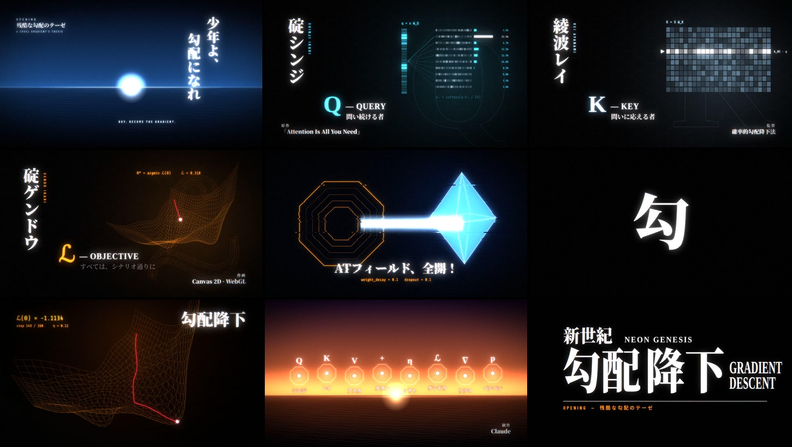
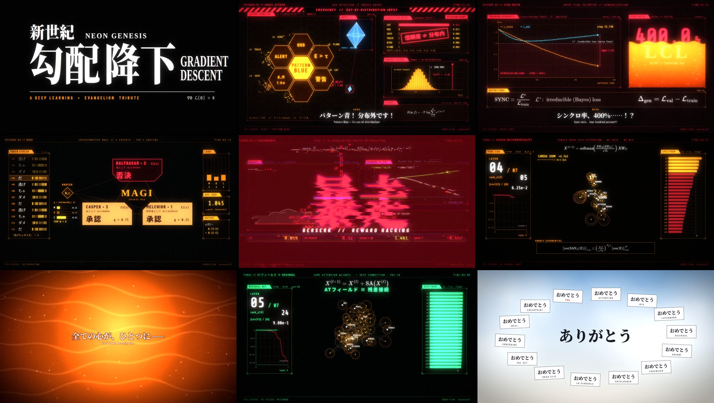

# 新世紀 勾配降下 — NEON GENESIS GRADIENT DESCENT

深層学習 × エヴァンゲリオンのトリビュート映像。**2本立て**です（どちらも 1920×1080 / 30fps / 音声付き）。

| | 作品 | 尺 | 形式 |
|---|---|---|---|
| **OP** | [`dist/neon_genesis_gradient_descent_opening.mp4`](dist/neon_genesis_gradient_descent_opening.mp4) | 1:26 | TVオープニングのオマージュ。128 BPM のオリジナル曲に合わせたカット割り |
| **本編** | [`dist/neon_genesis_gradient_descent_episodes.mp4`](dist/neon_genesis_gradient_descent_episodes.mp4) | 2:33 | 各話形式。タイトルカード、NERV 風の HUD、台詞で ML の概念を1話ずつ扱う |

映像も音も**全部コードから生成**しています。素材の取り込みはしていません。Canvas 2D と WebGL のポストエフェクトで描画し、
数式は MathJax で組版、音楽と効果音は NumPy/SciPy でオシレーターから合成しています。

---

## OP「残酷な勾配のテーゼ」



曲はオリジナルです（128 BPM、ニ短調、イントロ → リフ → A メロ → B メロ → サビ（王道進行）→ アウトロ）。
アニメ OP の文法に沿って組んでいます。

| 小節 | 映像 |
|---|---|
| イントロ | 水平線と光点。縦書きの「少年よ、勾配になれ」。十字の光で開幕 |
| タイトル | 「新／世／紀／勾配／降下」を1〜3フレームずつ白黒反転で連打 |
| リフ | セフィロトの樹＝計算グラフ、使徒と AT フィールド、MAGI、漢字フラッシュ |
| A メロ | キャラクターカード: **シンジ = Q**（問い続ける者）、**レイ = K**（問いに応える者）、**アスカ = V**（自分の価値を示す者）、**カヲル = +（残差）**（君を、君のままに） |
| B メロ | **ミサト = η（学習率）**（導く者、ときどき高すぎる）、**ゲンドウ = ℒ（目的関数）**（すべては、シナリオ通りに）、**ゼーレ = 12 本の attention head** |
| ブリッジ | causal attention 行列が拍ごとに埋まっていき、16分で「勾配になれ！！！」 |
| サビ | 初号機の発進（forward pass が12ブロックを駆け上がる）→ AT フィールド全開 vs 使徒の加粒子砲 → ロンギヌスの槍 = `clip_grad_norm_` → 損失曲面を勾配降下 → 1フレーム挿入つきのクライマックス |
| アウトロ | 夕景に全員が並ぶ → ロゴが1パーツずつ打ち込まれる |

各カードの可視化は実際に計算しています（Q の softmax 注意重み、V の加重和、学習率の warmup → cosine、損失曲面上の勾配降下の軌跡）。

## 本編



| 話 | エヴァ | 深層学習 | 画面上で実際に計算しているもの |
|---|---|---|---|
| 0 | MAGI 起動 / セフィロトの樹 | 計算グラフの順伝播・逆伝播 | 10ノード22辺のグラフ上をパルスが往復 |
| 1 | 使徒、襲来 — **パターン青** | **分布外（OOD）検知** | ロジット `[2.6, −1.9, …]` → softmax は「猫 97.3%」と言うのに、エネルギー `E(x) = −T log Σ e^{f/T} = −2.63` が閾値（in-dist の TPR 95%）を超えて検知（Liu+ 2020）。マハラノビス距離もクラスのガウス分布から計算 |
| 2 | シンクロ率 **400%**、LCL に溶ける | **過学習** | `SYNC ≡ L*/L_train`（L* はベイズ誤差）。100% を超える＝ノイズ床より下まで訓練データに合わせている＝丸暗記。初期値の 41.3% は第弐話へのオマージュ（曲線は説明用） |
| 3 | MAGI（三賢者）の合議 | **Sparse Mixture-of-Experts**（N=3, top-2） | 「逃げちゃダメだ」×3 のトークンを softmax ルーターが振り分け、Switch 型の補助損失を計算。三人格が同じ重みから分かれた＝sparse upcycling |
| 4 | **拘束具**（装甲ではない）、初号機の**暴走** | **RLHF の KL ペナルティと報酬ハッキング** | KL 正則化目的関数の厳密な最適解 `π_β ∝ π_ref · exp(r_φ/β)` を β → 0 まで掃引。代理報酬は上がり続け、真の報酬は Gao+ 2022 型の逆U字を描いて崩れる |
| 終 | **人類補完計画**、AT フィールド＝心の壁 | **Self-Attention のランク崩壊**（Dong+ 2021） | 48トークン×24次元に単一ヘッド attention を7層かける。スキップ接続なしだと ‖res(X)‖/‖X‖ が 0.97 → 0.66 → 0.11 → 1e-4 → 2e-13 → float64 の ε と**二重指数的に**崩壊（ランク1＝全ての心がひとつに）。同じ重みでも**残差接続**を入れれば、各トークンは自分を保つ |
| 最終話 | まごころを、君に | **残差を、君に** — *ATTENTION IS NOT ALL YOU NEED.* | |
| 終劇 | おめでとう | 学習収束 | 「教師モデルに、ありがとう／事前学習に、さようなら／そして、全ての勾配に／おめでとう」 |

---

## ビルド方法

必要なもの: Node 18+, Python 3.10+（numpy, scipy）, ffmpeg (libx264), Chromium (Playwright), Noto CJK フォント。

```bash
npm i                                              # playwright, mathjax-full
npm run formulas                                   # TeX → SVG (src/formulas.js)
for f in episodes opening; do
  node tools/render.mjs --film $f --cues           # 映像タイムラインから音響キューを書き出し → out/$f/cues.json
done
npm run audio                                      # 両方のスコアを合成 → out/{episodes,opening}/score.wav
node tools/render.mjs --film opening --video --workers 4     # フレームを描画 → out/opening/segments/*.mp4
bash tools/mux.sh opening                          # 結合 + 音声合成 → dist/…_opening.mp4
node tools/render.mjs --film episodes --stills 23,110        # 確認用の静止画
```

各フレームは時刻 `t` の純粋関数なので、どのフレームも単独で描画できます（並列ワーカーで分担）。

## ファイル構成

```
episodes.html / opening.html   各作品のエントリページ
src/core.js                    描画キット（HUD パネル、グラフ、タイトルカード、字幕、数式、正八面体…）
src/fx.js                      WebGL ポスト処理（ブルーム、色収差、グリッチ、走査線、グレイン）
src/main.js                    タイムライン組み立て、描画のエントリポイント
src/scenes/*.js                本編の各話（数値計算もここ）
src/opening/op.js              OP の全カット（128 BPM の小節グリッド）
audio/synthlib.py              共通シンセキット（オシレーター、フィルタ、楽器、リバーブ、ミックス）
audio/score_episodes.py        本編のスコア
audio/score_opening.py         OP 曲「残酷な勾配のテーゼ」（メロディ・コード・アレンジ）
tools/render.mjs               ヘッドレス Chromium → ffmpeg のレンダリングドライバ
tools/mux.sh                   映像 + 音声 → dist/
```

## クレジット

- 『新世紀エヴァンゲリオン』（庵野秀明 / カラー / GAINAX）への非公式ファントリビュートです。権利者とは一切関係ありません。
  公式のロゴ・映像・音楽は使っていません。OP 曲もメロディ・コードとも完全オリジナルです。
  書体は Noto Serif/Sans CJK JP、Barlow Condensed、Share Tech Mono、JetBrains Mono（いずれも OFL）。
- 参考文献: Vaswani et al. 2017, Liu et al. 2020 (Energy-based OOD), Nakkiran et al. 2019 (Deep Double Descent),
  Shazeer et al. 2017 / Fedus et al. 2021 (MoE), Komatsuzaki et al. 2022 (Sparse Upcycling),
  Gao, Schulman & Hilton 2022 (Reward Model Overoptimization),
  Dong, Cordonnier & Loukas 2021 (Attention is Not All You Need: Pure Attention Loses Rank Doubly Exponentially with Depth).
